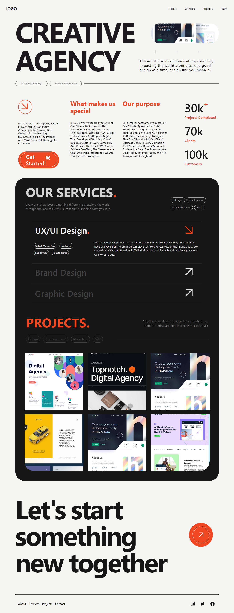

## TODO List

✅ Create main page.

✅ Make the website responsive.

🔜 Create other pages.

## What is this project

I wanted to build something unique that I would use myself. That's why I built this project, it can be used as a personal portfolio or an agency website.

## Screenshots



## Tech Stack

React, Typescript, TailwindCSS

## Run Locally

Clone the project

```bash
  git clone https://link-to-project
```

Go to the project directory

```bash
  cd my-project
```

Install dependencies

```bash
  npm install
```

Start the server

```bash
  npm start
```
